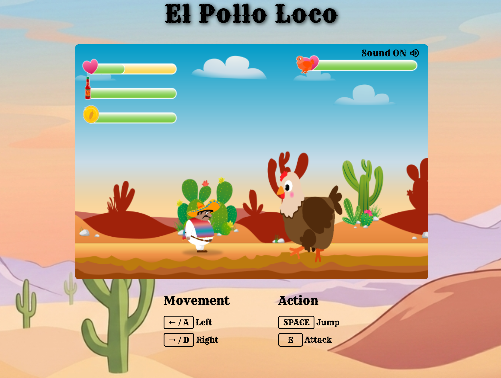
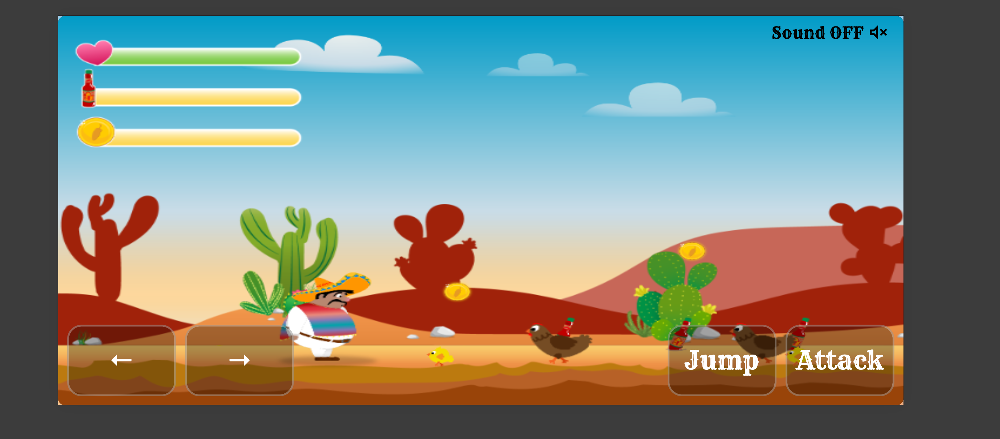

# El Pollo Loco 🐔

A jump-and-run game built with vanilla JavaScript and OOP.

🔗 [Live Demo](#) ← coming soon!

## 🎮 Features
- Jump & Run gameplay with enemies and a final boss
- Collect coins and bottles
- Health, coin and bottle status bars
- Mobile & tablet support with touch controls

## 🕹️ How to play
| Key | Action |
|-----|--------|
| ← / A | Move left |
| → / D | Move right |
| Space | Jump |
| E | Throw bottle |

## 📸 Screenshots

## 🛠️ Technologies
- Vanilla JavaScript (OOP)
- HTML5 Canvas
- CSS3

## 📁 Project structure
- `js/` - Game logic
- `models/` - Game classes
- `assets/` - Images & sounds

## 🚀 Installation
1. Clone the repository
2. Open `index.html` in your browser

## ⚠️ Notice
Image assets are property of Developer Akademie GmbH and may not be used without permission.